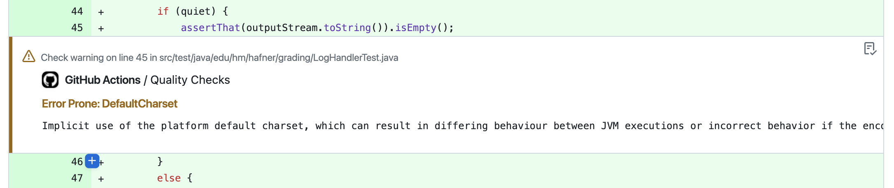

# Autograding GitHub Action 

This GitHub action autogrades projects based on a configurable set of metrics and gives feedback on pull requests (or single commits). I use this action to automatically grade student projects in my lectures at the Munich University of Applied Sciences. Please have a look at my [companion coding style](https://github.com/uhafner/codingstyle) and [Maven parent POM](https://github.com/uhafner/codingstyle-pom) to see how to create Java projects that can be graded using the GitHub action.

The individual metrics can be configured by defining an appropriate CONFIG property (in JSON format) in your GitHub workflow:

```yaml
name: Autograde project

on:
  push

jobs:
  grade-project:
    name: Autograde project
    runs-on: ubuntu-latest
    steps:
      - uses: actions/checkout@v4
      - name: Set up JDK 17
        uses: actions/setup-java@v3
        with:
          distribution: 'temurin'
          java-version: '17'
          check-latest: true
          cache: 'maven'
      - name: Set up Maven
        uses: stCarolas/setup-maven@v4
        with:
          maven-version: 3.9.5
      - name: Build # (compile, test with code and mutation coverage, and run static analysis)
        run: mvn -ntp clean verify -Ppit
      - name: Run Autograding
        uses: uhafner/autograding-github-action@v2.0.0-alpha-2
        with:
          TOKEN: ${{ secrets.GITHUB_TOKEN }}
          HEAD_SHA: ${{github.event.pull_request.head.sha}}
          CHECKS_NAME: "Autograding GitHub Action"
          CONFIG: >
            {
              "tests": {
                "tools": [
                  {
                    "id": "test",
                    "name": "Unittests",
                    "pattern": "**/target/*-reports/TEST*.xml"
                  }
                ],
                "name": "JUnit",
                "skippedImpact": -1,
                "failureImpact": -5,
                "maxScore": 100
              } 
            }
```

Currently, you can select from the metrics shown in the following sections. Each metric can be configured individually. All of these configurations are composed in the same way: you can define a list of tools that are used to collect the data, a name for the metric, and a maximum score. All tools need to provide a pattern where the autograding action can find the result files in the workspace (e.g., JUnit XML reports). Additionally, each tool needs to provide the parser ID of the tool so that the underlying model can find the correct parser to read the results. See [analysis model](https:://github.com/jenkinsci/analysis-model) and [coverage model](https:://github.com/jenkinsci/coverage-model) for the list of supported parsers.

Additionally, you can define the impact of each result (e.g., a failed test, a missed line in coverage) on the final score. The impact is a positive or negative number and will be multiplied with the actual value of the measured items during the evaluation. Negative values will be subtracted from the maximum score to compute the final score. Positive values will be directly used as the final score. You can choose the type of impact that matches your needs best.

## Test statistics (e.g., number of failed tests)


This metric can be configured using the following parameters:

```json
{
  "tests": {
    "tools": [
      {
        "id": "test",
        "name": "Unittests",
        "pattern": "**/junit*.xml"
      }
    ],
    "name": "JUnit",
    "passedImpact": 10,
    "skippedImpact": -1,
    "failureImpact": -5,
    "maxScore": 100
  }
}
``` 

You can either count passed tests as positive impact or failed tests as negative impact (or use a mix of both). For failed tests, the test error message and stack trace will be shown directly after the summary in the pull request.

## Code or mutation coverage (e.g., line coverage percentage)


This metric can be configured using the following parameters:

```json
{
  "coverage": [
    {
      "tools": [
        {
          "id": "jacoco",
          "name": "Line Coverage",
          "metric": "line",
          "pattern": "**/jacoco.xml"
        },
        {
          "id": "jacoco",
          "name": "Branch Coverage",
          "metric": "branch",
          "pattern": "**/jacoco.xml"
        }
      ],
      "name": "JaCoCo",
      "maxScore": 100,
      "coveredPercentageImpact": 1,
      "missedPercentageImpact": -1
    },
    {
      "tools": [
        {
          "id": "pit",
          "name": "Mutation Coverage",
          "metric": "mutation",
          "pattern": "**/mutations.xml"
        }
      ],
      "name": "PIT",
      "maxScore": 100,
      "coveredPercentageImpact": 1,
      "missedPercentageImpact": 0
    }
  ]
}
```

You can either use the covered percentage as positive impact or the missed percentage as negative impact (a mix of both makes little sense but would work as well). Please make sure to define exactly a unique and supported metric for each tool. For example, JaCoCo provides `line` and `branch` coverage, so you need to define two tools for JaCoCo. PIT provides mutation coverage, so you need to define a tool for PIT that uses the metric `mutation`. 

Missed lines or branches as well as survived mutations will be shown as annotations in the pull request:


## Static analysis (e.g., number of warnings)


This metric can be configured using the following parameters:

```json
{
  "analysis": [
    {
      "name": "Style",
      "tools": [
        {
          "id": "checkstyle",
          "name": "CheckStyle",
          "pattern": "**/target/checkstyle-result.xml"
        },
        {
          "id": "pmd",
          "name": "PMD",
          "pattern": "**/target/pmd.xml"
        }
      ],
      "errorImpact": 1,
      "highImpact": 2,
      "normalImpact": 3,
      "lowImpact": 4,
      "maxScore": 100
    },
    {
      "name": "Bugs",
      "tools": [
        {
          "id": "spotbugs",
          "name": "SpotBugs",
          "pattern": "**/target/spotbugsXml.xml"
        }
      ],
      "errorImpact": -11,
      "highImpact": -12,
      "normalImpact": -13,
      "lowImpact": -14,
      "maxScore": 100
    }
  ]
}
```

Normally, you would only use a negative impact for this metric: each warning (of a given severity) will reduce the final score by the specified amount. You can define the impact of each severity level individually. 

All warnings will be shown as annotations in the pull request:




#### Action Configuration

This action can be configured using the following parameters (see example above):
- ``TOKEN: ${{ secrets.GITHUB_TOKEN }}``: mandatory GitHub access token.
- ``CHECKS_NAME: "Name of checks"``: optional name of GitHub checks (overwrites the default: "Autograding result").
- ``HEAD_SHA: ${{github.event.pull_request.head.sha}}``: optional SHA of the pull request head. If not set then 
``GITHUB_SHA`` will be used.
- ``CONFIG: "{...}"``: optional configuration, see sections above for details. Or consult the [autograding-model](https://github.com/uhafner/autograding-model) project for details. If not specified, a [default configuration](src/main/resources/default-config.json) will be used.

