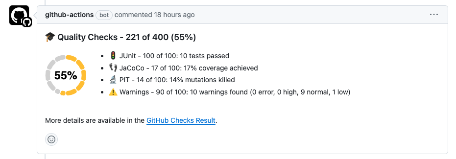
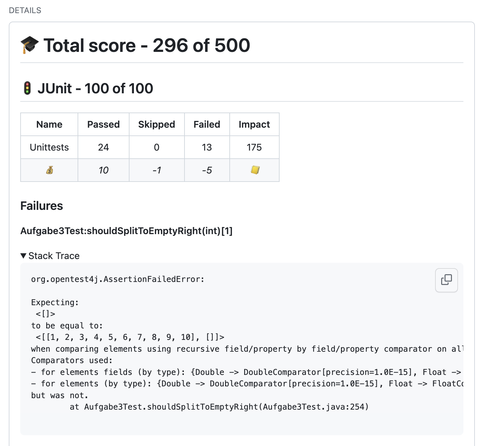
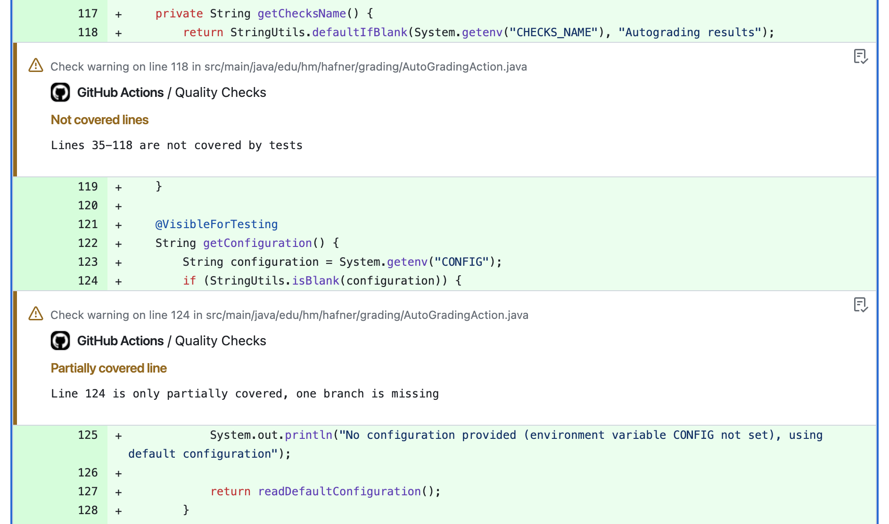

# Autograding GitHub Action 

[](https://github.com/uhafner/autograding-github-action/actions/workflows/cd.yml)
[](https://github.com/uhafner/autograding-github-action/actions/workflows/codeql.yml)
[](https://github.com/uhafner/autograding-github-action/actions/workflows/dogfood.yml)
[](https://github.com/uhafner/autograding-github-action/actions/workflows/dogfood.yml)
[](https://github.com/uhafner/autograding-github-action/actions/workflows/dogfood.yml)
[](https://github.com/uhafner/autograding-github-action/actions/workflows/dogfood.yml)
[](https://github.com/uhafner/autograding-github-action/actions/workflows/dogfood.yml)

This GitHub action autogrades projects based on a configurable set of metrics and gives feedback on pull requests (or single commits) in GitHub. I use this action to automatically grade student projects in my lectures at the Munich University of Applied Sciences. 

You can see the results of this action in an [example pull request](https://github.com/uhafner/autograding-github-action/pull/311) and the associated [GitHub Checks output](https://github.com/uhafner/autograding-github-action/runs/19411191545). Another real-live example is visible in the [pull request](https://github.com/uhafner/java2-assignment1/pull/31) and [checks result](https://github.com/uhafner/java2-assignment1/runs/19411468263) of a fake student project. 



Please have a look at my [companion coding style](https://github.com/uhafner/codingstyle) and [Maven parent POM](https://github.com/uhafner/codingstyle-pom) to see how to create Java projects that can be graded using this GitHub action. If you want to use this action to visualize the coding quality without creating a grading percentage, then use my additional [Quality Monitor GitHub Action](https://github.com/uhafner/quality-monitor). If you are hosting your project on GitLab, then you might be interested in my [identical GitLab action](https://github.com/uhafner/autograding-gitlab-action) as well. 

Both actions are inspired by my Jenkins plugins: 
- [Jenkins Warnings plugin](https://github.com/jenkinsci/warnings-ng-plugin)
- [Jenkins Coverage plugin](https://github.com/jenkinsci/coverage-plugin)
- [Jenkins Autograding plugin](https://github.com/jenkinsci/autograding-plugin)

They work in the same way but are much more powerful and flexible and show the results additionally in Jenkins' UI.  

Please note that the action works on report files that are generated by other tools. It does not run the tests or static analysis tools itself. You need to run these tools in a previous step of your workflow. See the example below for details. This has the advantage that you can use a tooling you are already familiar with. So the action will run for any programming language that can generate the required report files. There are already more than [one hundred analysis formats](https://github.com/jenkinsci/analysis-model/blob/main/SUPPORTED-FORMATS.md) supported. Code and mutation coverage reports can use the JaCoCo, Cobertura, OpenCover and PIT formats, see the [coverage model](https:://github.com/jenkinsci/coverage-model) for details. Test results can be provided in the JUnit, XUnit, or NUnit XML-formats.

# GitHub Checks

The details output of the action is shown in the GitHub Checks tab of the pull request: 


# Configuration

The autograding action must be added as a separate step of your GitHub pipeline since it is packaged in a Docker container. This step should run after your normal build and testing steps so that it has access to all produced artifacts. Make sure to configure your build to produce the required report files (e.g., JUnit XML reports, JaCoCo XML reports, etc.) even when there are test failures or warnings found. Otherwise, the action will only show partial results.

```yaml
name: Autograde project

on:
  push

jobs:
  grade-project:
    name: Autograde project
    runs-on: ubuntu-latest
    steps:
      - uses: actions/checkout@v4
      - name: Set up JDK 21
        uses: actions/setup-java@v3
        with:
          distribution: 'temurin'
          java-version: '21'
          check-latest: true
          cache: 'maven'
      - name: Set up Maven
        uses: stCarolas/setup-maven@v5
        with:
          maven-version: 3.9.6
      - name: Build # (compile, test with code and mutation coverage, and run static analysis)
        run: mvn -V --color always -ntp clean verify -Ppit -Dmaven.test.failure.ignore=true
      - name: Extract pull request number # (commenting on the pull request requires the PR number)
        uses: jwalton/gh-find-current-pr@v1
        id: pr
      - name: Run Autograding
        uses: uhafner/autograding-github-action@v3
        with:
          github-token: ${{ secrets.GITHUB_TOKEN }}
          pr-number: ${{ steps.pr.outputs.number }}
          checks-name: "Autograding GitHub Action"
          config: > # Override default configuration: just grade the test results
            {
              "tests": {
                "tools": [
                  {
                    "id": "test",
                    "name": "Unittests",
                    "pattern": "**/target/*-reports/TEST*.xml"
                  }
                ],
                "name": "JUnit",
                "skippedImpact": -1,
                "failureImpact": -5,
                "maxScore": 100
              } 
            }
```

## Action Parameters

This action can be configured using the following parameters (see example above):
- ``github-token: ${{ secrets.GITHUB_TOKEN }}``: mandatory GitHub access token.
- ``config: "{...}"``: optional configuration, see sections above for details, or consult the [autograding-model](https://github.com/uhafner/autograding-model) project for the exact implementation. If not specified, a [default configuration](https://github.com/uhafner/autograding-model/blob/main/src/main/resources/default-config.json) will be used.
- ``pr-number: ${{ steps.pr.outputs.number }}``: optional number of the pull request. If not set, then just the checks will be published but not a pull request comment.
- ``checks-name: "Name of checks"``: optional name of GitHub checks (overwrites the default: "Autograding result").
- ``skip-annotations: true``: Optional flag to skip the creation of annotations (for warnings and missed coverage).
- ``max-warning-comments: <number>``: Optional parameter to limit the number of warning comments at specific lines. By default, all line comments are created.
- ``max-coverage-comments: <number>``: Optional parameter to limit the number of coverage comments at specific lines. By default, all line comments are created.

## Metrics Configuration

The individual metrics can be configured by defining an appropriate `config` property (in JSON format) in your GitHub workflow. Currently, you can select from the metrics shown in the following sections. Each metric can be configured individually. All of these configurations are composed in the same way: you can define a list of tools that are used to collect the data, a name and icon for the metric, and a maximum score. All tools need to provide a pattern where the autograding action can find the result files in the workspace (e.g., JUnit XML reports). Additionally, each tool needs to provide the parser ID of the tool so that the underlying model can find the correct parser to read the results. See [analysis model](https:://github.com/jenkinsci/analysis-model) and [coverage model](https:://github.com/jenkinsci/coverage-model) for the list of supported parsers.

Additionally, you can define the impact of each result (e.g., a failed test, a missed line in coverage) on the final score. The impact is a positive or negative number and will be multiplied with the actual value of the measured items during the evaluation. Negative values will be subtracted from the maximum score to compute the final score. Positive values will be directly used as the final score. You can choose the type of impact that matches your needs best.

## Test statistics (e.g., number of failed tests)



This metric can be configured using a JSON object `tests`, see the example below for details: 

```json
{
  "tests": {
    "tools": [
      {
        "id": "test",
        "name": "Unittests",
        "pattern": "**/junit*.xml"
      }
    ],
    "name": "JUnit",
    "passedImpact": 10,
    "skippedImpact": -1,
    "failureImpact": -5,
    "maxScore": 100
  }
}
``` 

You can either count passed tests as positive impact or failed tests as negative impact (or use a mix of both). Skipped tests will be listed individually. For failed tests, the test error message and stack trace will be shown directly after the summary in the pull request.

## Code or mutation coverage (e.g., line coverage percentage)


This metric can be configured using a JSON object `coverage`, see the example below for details:

```json
{
  "coverage": [
    {
      "tools": [
        {
          "id": "jacoco",
          "name": "Line Coverage",
          "metric": "line",
          "sourcePath": "src/main/java",
          "pattern": "**/jacoco.xml"
        },
        {
          "id": "jacoco",
          "name": "Branch Coverage",
          "metric": "branch",
          "sourcePath": "src/main/java",
          "pattern": "**/jacoco.xml"
        }
      ],
      "name": "JaCoCo",
      "maxScore": 100,
      "coveredPercentageImpact": 1,
      "missedPercentageImpact": -1
    },
    {
      "tools": [
        {
          "id": "pit",
          "name": "Mutation Coverage",
          "metric": "mutation",
          "sourcePath": "src/main/java",
          "pattern": "**/mutations.xml"
        }
      ],
      "name": "PIT",
      "maxScore": 100,
      "coveredPercentageImpact": 1,
      "missedPercentageImpact": 0
    }
  ]
}
```

You can either use the covered percentage as positive impact or the missed percentage as negative impact (a mix of both makes little sense but would work as well). Please make sure to define exactly a unique and supported metric for each tool. For example, JaCoCo provides `line` and `branch` coverage, so you need to define two tools for JaCoCo. PIT provides mutation coverage, so you need to define a tool for PIT that uses the metric `mutation`. 

Missed lines or branches as well as survived mutations will be shown as annotations in the pull request:




## Static analysis (e.g., number of warnings)


This metric can be configured using a JSON object `analysis`, see the example below for details:

```json
{
  "analysis": [
    {
      "name": "Style",
      "id": "style",
      "tools": [
        {
          "id": "checkstyle",
          "name": "CheckStyle",
          "pattern": "**/target/checkstyle-result.xml"
        },
        {
          "id": "pmd",
          "name": "PMD",
          "pattern": "**/target/pmd.xml"
        }
      ],
      "errorImpact": 1,
      "highImpact": 2,
      "normalImpact": 3,
      "lowImpact": 4,
      "maxScore": 100
    },
    {
      "name": "Bugs",
      "id": "bugs",
      "icon": "bug",
      "tools": [
        {
          "id": "spotbugs",
          "name": "SpotBugs",
          "sourcePath": "src/main/java",
          "pattern": "**/target/spotbugsXml.xml"
        }
      ],
      "errorImpact": -11,
      "highImpact": -12,
      "normalImpact": -13,
      "lowImpact": -14,
      "maxScore": 100
    }
  ]
}
```

Normally, you would only use a negative impact for this metric: each warning (of a given severity) will reduce the final score by the specified amount. You can define the impact of each severity level individually. 

All warnings will be shown as annotations in the pull request:


## Pull Request Comments

The action writes a summary of the results to the pull request as well. Since the action cannot identify the correct pull request on its own, you need to provide the pull request as an action argument. 

```yaml
  [... ]

      - name: Extract pull request number
        uses: jwalton/gh-find-current-pr@v1
        id: pr
      - name: Run Autograding
        uses: uhafner/autograding-github-action@v3
        with:
          github-token: ${{ secrets.GITHUB_TOKEN }}
          pr-number: ${{ steps.pr.outputs.number }}
          checks-name: "Autograding GitHub Action"
          config: {...}

  [... ]
```

Configuring the action in this way will produce an additional comment of the form:


## Automatic Badge Creation

[](https://github.com/uhafner/autograding-github-action/actions/workflows/dogfood.yml)
[](https://github.com/uhafner/autograding-github-action/actions/workflows/dogfood.yml)
[](https://github.com/uhafner/autograding-github-action/actions/workflows/dogfood.yml)
[](https://github.com/uhafner/autograding-github-action/actions/workflows/dogfood.yml)
[](https://github.com/uhafner/autograding-github-action/actions/workflows/dogfood.yml)


The results of the action can be used to create various badges that show the current status of the project. The action writes the results of the action to a file called `metrics.env` in the workspace. This file can be used to create badges using the [GitHub Badge Action](https://github.com/marketplace/actions/badge-action). The following snippet shows how to create several badges for your project, the full example is visible in [my autograding workflow](https://raw.githubusercontent.com/uhafner/autograding-github-action/main/.github/workflows/dogfood.yml). 

```yaml
  [... Autograding, see above ... ]
  - name: Write metrics to GitHub output
    id: metrics
    run: |
      cat metrics.env >> "${GITHUB_OUTPUT}"
      mkdir -p badges
  - name: Generate the badge SVG image for the line coverage
    uses: emibcn/badge-action@v2.0.2
    with:
      label: 'Line coverage'
      status: ${{ steps.metrics.outputs.line }}%
      color: 'green'
      path: badges/line-coverage.svg
  - name: Generate the badge SVG image for the branch coverage
    uses: emibcn/badge-action@v2.0.2
    with:
      label: 'Branch coverage'
      status: ${{ steps.metrics.outputs.branch }}%
      color: 'green'
      path: badges/branch-coverage.svg
  - name: Generate the badge SVG image for the mutation coverage
    uses: emibcn/badge-action@v2.0.2
    with:
      label: 'Mutation coverage'
      status: ${{ steps.metrics.outputs.mutation }}%
      color: 'green'
      path: badges/mutation-coverage.svg
  - name: Generate the badge SVG image for the style warnings
    uses: emibcn/badge-action@v2.0.2
    with:
      label: 'Style warnings'
      status: ${{ steps.metrics.outputs.style }}
      color: 'orange'
      path: badges/style-warnings.svg
  - name: Generate the badge SVG image for the potential bugs
    uses: emibcn/badge-action@v2.0.2
    with:
      label: 'Potential Bugs'
      status: ${{ steps.metrics.outputs.bugs }}
      color: 'red'
      path: badges/bugs.svg
  - name: Commit updated badges
    continue-on-error: true
    run: |
      git config --local user.email "action@github.com"
      git config --local user.name "GitHub Action"
      git add badges/*.svg
      git commit -m "Update badges with results from latest autograding" || true
  - name: Push updated badges to GitHub repository
    uses: ad-m/github-push-action@master
    if: ${{ success() }}
    with:
      github_token: ${{ secrets.GITHUB_TOKEN }}
      branch: main
```
