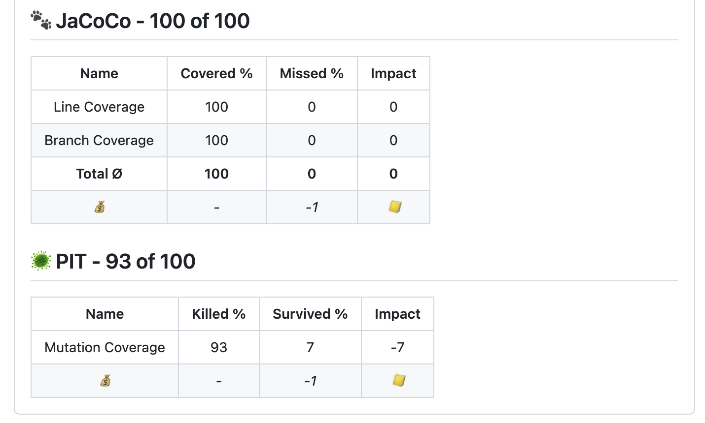

# Autograding GitHub Action 

This GitHub action autogrades projects based on a configurable set of metrics and gives feedback on the pull request. 
Currently, you can select from the following metrics:

## Test statistics (e.g., number of failed tests)


## Code coverage (e.g., line coverage percentage)



## PIT mutation coverage (e.g., missed mutations' percentage)


## Static analysis (e.g., number of warnings)


                   
### How to use?

Here is an example configuration you could use in your workflow.

```
name: 'Autograding Pull Pequest'

on:
  pull_request:
    branches: [ master ]

jobs:
  build:
    runs-on: ubuntu-latest
    steps:
      - uses: actions/checkout@v2
      - name: Build
        run: mvn -V -ntp clean verify -Dmaven.test.failure.ignore=true --file pom.xml
      - name: Autograding
        uses: uhafner/autograding-github-action@v0.1.0
        with:
          TOKEN: ${{ secrets.GITHUB_TOKEN }}
          HEAD_SHA: ${{github.event.pull_request.head.sha}}
```

#### Configuration

- ``TOKEN: ${{ secrets.GITHUB_TOKEN }}``: mandatory GitHub access token.
- ``CHECKS_NAME: "Name of checks"``: optional name of GitHub checks (overwrites default: "Autograding result").
- ``HEAD_SHA: ${{github.event.pull_request.head.sha}}``: optional SHA of the pull request head. If not set then 
``GITHUB_SHA`` will be used.
- ``CONFIG: "{\"analysis\": { \"maxScore\": 100, \"errorImpact\": -5}}"``: optional configuration, see 
[manual](https://github.com/uhafner/autograding-model) for details. If not provided a [default configuration](default.conf)
will be used.

